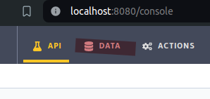
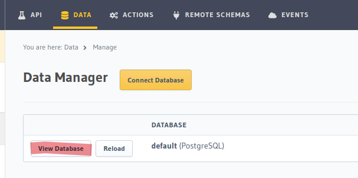
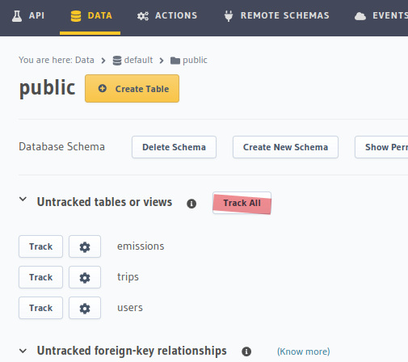
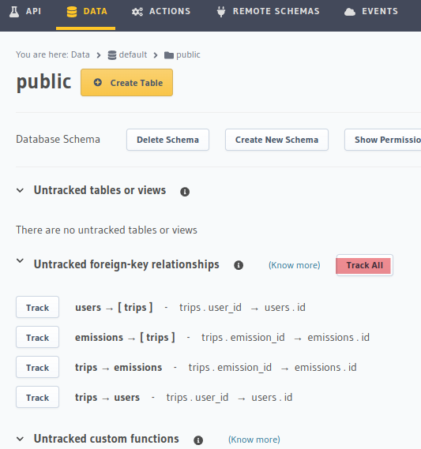

# MyJourneyFootprint

## Local Setup

### 1. Run the application

To run the application for development, run the following command in the root folder of the project:

`docker compose up --build -d`

Application ports:

- Client: 5173
- Server: 3000
- Hasura: 8080
- PostgreSQL: 5432

### 2. Initialise the data

To initalise the database data, navigate to the `set_up` folder and run the following command:

`node setupDB.js`

### 3. Track the database with Hasura

Then go to `http://localhost:8080` to access the Hasura control panel.

Then click the "Data" tab as seen below.

Then click "View Database".

Then click "Track All" in the tables section.

Then click "Track All" in the relationships section.

### 4. Done!

From this point onwards, the application can be started with the command from step 1, and stopped with `docker compose down`.

If any issues are experienced with the database or hasura instance, it is recommended to stop the application and delete the docker volumes created by this project. WARNING: This will delete all data stored in this projects database.

## Deployment

The application is automatically deployed via a GitHub CI/CD pipeline when changes are pushed to the `main` branch. It builds the docker image, pushes it to our private registry, then runs the update script on the server. The files required for deployment can be found in the `deploy` folder.
